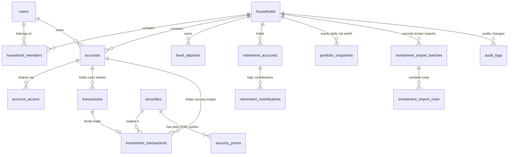

# Database Schema & ERD Documentation — PFinanc

PFinanc uses PostgreSQL with custom SQL schema migrations. All monetary amounts use `NUMERIC(18,2)`, share prices/NAVs use `NUMERIC(18,4)`, and holding quantities use `NUMERIC(24,8)`.

---

## 1. Entity-Relationship Diagram (ERD)



---

## 2. Table Specifications

### Core Financial Ledger Tables
1. **`users`**: Identity, password hash, name, avatar.
2. **`households`**: Family financial unit.
3. **`household_members`**: Join table mapping users to households with roles (`OWNER`, `ADMIN`, `MEMBER`, `VIEWER`).
4. **`accounts`**: Cash, bank, credit card, and brokerage accounts (`BANK`, `CASH`, `WALLET`, `CREDIT_CARD`, `BROKERAGE`, `MUTUAL_FUND`, `OTHER`).
5. **`transactions`**: Canonical cash ledger entries (`INCOME`, `EXPENSE`, `TRANSFER`, `REFUND`, `OTHER`).
6. **`transfers`**: First-class transfer entity linking source debit and destination credit.

### Investment & Portfolio Tables (Phase 2)
7. **`securities`**: Canonical instruments for Stocks, Mutual Funds, and ETFs (Symbol, ISIN, Exchange, Security Type, Asset Class, Sector, Fund House).
8. **`security_prices`**: Historical and EOD closing prices/NAVs (`price_date`, `open`, `high`, `low`, `close`, `is_stale`).
9. **`investment_transactions`**: Security trades (`BUY`, `SELL`, `SIP`, `DIVIDEND`, `BONUS`, `SPLIT`, `INTEREST`, `REDEMPTION`, `FEE`, `TAX`) with quantity (`NUMERIC(24,8)`), price per unit, fees, taxes, and optional `linked_cash_transaction_id`.
10. **`fixed_deposits`**: Term deposits with principal, interest rate %, compounding frequency (`MONTHLY`, `QUARTERLY`, `HALF_YEARLY`, `ANNUALLY`, `AT_MATURITY`), start/maturity dates, and accrued valuation.
11. **`retirement_accounts`**: EPF, PPF, and NPS corpus accounts.
12. **`retirement_contributions`**: Monthly contribution logs (Employee share, Employer share, Interest, Withdrawals, Closing balance).
13. **`portfolio_snapshots`**: Periodic snapshots of invested value, market value, realized P&L, and unrealized P&L.
14. **`investment_import_batches` & `investment_import_rows`**: Ingestion staging for tradebook CSV statements.
15. **`audit_logs`**: Immutable ledger of all system entity mutations.

---

## 3. Database Backup & Restore Guide

### 1. Database Backup
```bash
pg_dump -h localhost -p 5432 -U postgres -d pfinanc -F c -b -v -f "pfinanc_backup_$(date +%Y%m%d_%H%M%S).dump"
```

### 2. Database Restore
```bash
# Drop and recreate database
dropdb -h localhost -U postgres pfinanc
createdb -h localhost -U postgres pfinanc

# Restore from dump file
pg_restore -h localhost -p 5432 -U postgres -d pfinanc -v "pfinanc_backup_<timestamp>.dump"
```
